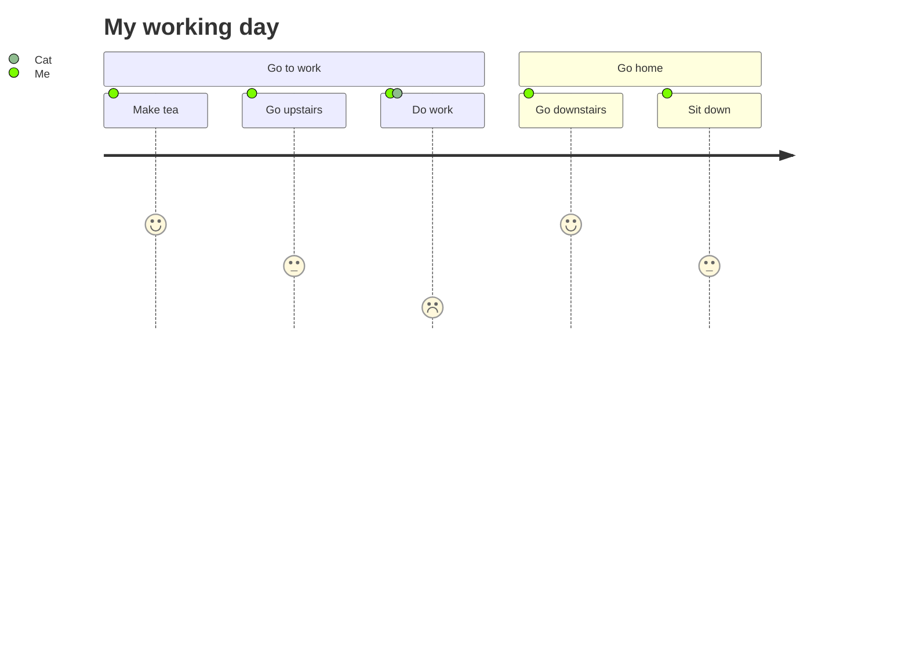

威胁建模：Threat Modeling

kino
kino
寻求自救的小兽
​关注他
28 人赞同了该文章
0x01、基础概念
在信息安全领域，很重要的三个基本要素是CIA——

机密性（Confidentiality）：保护信息免向未授权的人披露
一致性（Integrity）：保护信息免受未授权的人更改
可用性（Availability）：让信息供已授权的人需要时可取用

https://pic4.zhimg.com/80/v2-142a750eec664f2288e297d9c4d83d4f_720w.webp

​那什么是对信息三要素产生的威胁呢？首先来看看风险由什么构成。

​公司的资产（Assets）会受到各种威胁（Threats）影响，这些威胁可能是黑客等人为因素，也可能是火灾地震等自然因素。威胁通过利用系统的脆弱性（Vulnerabilities）可导致暴露（Exposure），这就是风险（Risk）。对策是使用防护措施（Safeguards），缓解风险使资产得到安全保障。

0x02、威胁建模
威胁建模就是这样一种分析和解决问题的结构化方法，用来识别、量化并应对威胁，利用抽象的方法来帮助思考风险。威胁建模允许系统安全人员传达安全漏洞的破坏力，然后定义防范或减轻系统威胁的对策，并按轻重缓急实施补救措施。那么——

谁用？——PM（Program Manager，即总工程师）、安全测试人员、开发人员、客户和黑客都会用。从产品角度、黑客角度、数据流角度分别考虑风险。
做什么？——一个标准化，可落地到文档的Check List，使得安全能力不因人员水平参差而有不同。
为什么做？——便于系统服务及时识别风险，尽早修复。
什么时候做？——最好在设计阶段做（参考微软的安全开发生命周期SDL），每个公司的客观条件不同，实践上也会不一样。
在SDL中的一个理念是“Secure by Design, Secure by Default, Secure in Deployment and Communication”，亦称为SD3+C。当然了，在设计阶段并无法完全考虑到所有风险因素，但通过标准化的设计考虑，可以在更早的时候，开发资源更充足的情况下，利用20%的投入及时解决掉80%的风险，而不至于在后期使得改造成本无比巨大甚至无法规避设计上的缺陷，只能通过打各种补丁规避，还是一个更好的做法。当然了，威胁建模本身也是一个耗成本的活，这个视乎企业对此类安全的重视程度。

它的通用步骤为：

step 1、Diagram，画图了解场景。应用程序生成数据流图（DFD）将系统分解成部件，包含如下元素：

数据流（箭头线段）：通过网络连接，命名管道，RPC通道等移动的数据。
数据存储（双横线）：表示文件，数据库，注册表项以及类似项。
进程（圆形）：计算机运行的计算或程序。
交互方（方形）：系统的端点，例如人，web服务器和服务器。
信任边界（虚线）：表示可信元素与不可信元素之间的边界。

​step 2、Identify，分析威胁。在上图中每一类部件都有对应STRIDE模型的威胁。什么是STRIDE模型？

Spoofing（欺骗）——做好鉴权；
Tampering（篡改）——保证完整性；
Repudiation（抵赖）——加强可追溯；
Information Disclosure（信息泄露）——加密；
Denial of Service（拒绝服务）——保证可用性；
Elevation of Privileges（权限提升）——加强权限控制；

对应到组件中，有如下关系。其中R项的勾是红色是指数据存储的R（抵赖）可能有也可能没有，只有当分析的数据存储用作审计时，才要去分析R抵赖的威胁，不作为审计使用就不用分析R抵赖威胁。

step 3、Mitigate，缓解威胁。在这一步输出威胁列表，对每个威胁项进行评估处理。因为威胁很多也需要根据优先级来合理投入。比较简单的直接使用ALE（年度预期损失）来评价：危险 = 发生概率 × 潜在的损失。也可以使用DREAD进行——

Damage potential，潜在损失，如果缺陷被利用，损失有多大？
Reproducibility，重现性，重复产生攻击的难度有多大？
Exploitability，发起攻击的难度有多大？
Affected users，用粗略的百分数表示，有多少用户受到影响？
Discoverability，缺陷容易发现吗？
所有项可进行“高中低”评价，来进行输出用于决策。

step 4、Validate，验证缓解措施，当满足基线要求，可再次进行下一个迭代。包括基线水平的提高，DFD图下钻设计，以及另一个新项目的威胁建模分析等迭代。

0x03、后记
不同公司有不同文化风格，在威胁建模应用方面也大不相同。某些企业可能因一个功能设计上的缺陷，后期需要花上百万来修复，相比小步迭代快速上线的轻量级应用，当然需要在设计阶段更多下功夫。同时，威胁建模对各个流程环节的细化把控，在云原生时代，重视更轻量级应用的现代，也会部分理念是有冲突的，需要全局权衡来看待里面的安全风险和解决方案。

发布于 2019-07-11 21:48
